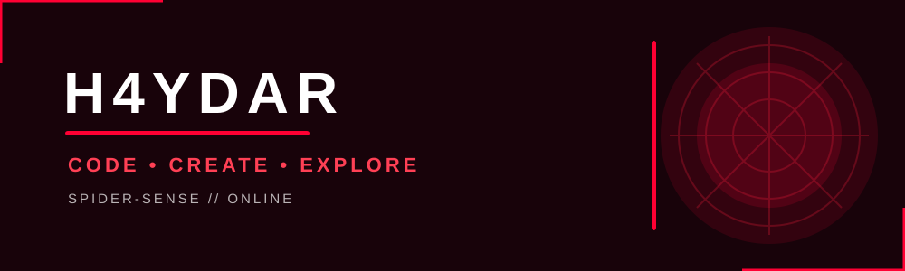

<div align="center">



</div><div align="center">

# 🕷️ H4YDAR

### `CODE • CREATE • EXPLORE`


<br>

**🕸️ Welcome to my digital web. 🕸️**

</div>

---

# 🕷️ A NEW DAY BEGINS...

> Every project starts with an idea.
> Every idea becomes a mission.
> And every mission begins with one line of code.

I'm **H4YDAR**, a student and programmer who enjoys exploring programming, computer vision, interactive applications, and creative technology.

I'm currently learning by building projects and experimenting with new ideas.

---

# 🕸️ SPIDER-SENSE

```text
STATUS
────────────────────────────
🟢 SYSTEM       ONLINE
🟢 CODING       ACTIVE
🟢 CREATIVITY   UNLOCKED
🟢 LEARNING     IN PROGRESS
🕷️ SPIDER-SENSE  DETECTING...
```

---

# 🧪 WEB-SHOOTER ARSENAL

<div align="center">


</div>

### Technologies I'm exploring

* 🐍 **Python**
* 👁️ **OpenCV**
* ✋ **MediaPipe**
* 🔢 **NumPy**
* 🎮 **Pygame**
* 🌐 **OpenGL**
* 🐙 **Git & GitHub**

---

# 🕷️ MISSION LOG

## 🌌 NebulaHeart 3D

> **Interactive 3D • Computer Vision • Hand Tracking**

One of my main projects is **NebulaHeart 3D**, an interactive particle visualization controlled by hand gestures.

### ✋ Gesture System

| Gesture       | Mission         |
| ------------- | --------------- |
| 🖐️ Open Hand | 🌌 Cosmic Space |
| ☝️ One Finger | 🪐 Saturn       |
| ✌️ Peace      | 💙 I LOVE U     |
| ✊ Fist        | ❤️ Heart        |

### ⚡ Features

* ✋ Real-time hand tracking
* 📷 Camera-based interaction
* 🌌 3D particle system
* 🪐 Saturn visualization
* 💙 Interactive `I LOVE U`
* ❤️ Animated heart
* 🎮 Keyboard controls
* 📊 Real-time FPS

---

# 💥 POW! — CURRENT MISSIONS

### 🐍 Python

Learning more about Python and building interactive applications.

### 👁️ Computer Vision

Exploring how computers can understand images and movement.

### ✋ Hand Tracking

Experimenting with gesture-controlled interfaces.

### 🌌 3D Graphics

Learning how particles and 3D objects can be used to create interactive experiences.

---

# 🧬 SPIDER-SENSE / CURRENTLY LEARNING

```text
Python          █████████░░  Learning
Computer Vision ████████░░░  Learning
Hand Tracking   ████████░░░  Building
3D Graphics     ██████░░░░░  Exploring
GitHub          ███████░░░░  Improving
```

---

# 🏆 MISSIONS COMPLETED

* ✅ Built a Python hand-tracking project
* ✅ Created an interactive 3D particle system
* ✅ Connected hand gestures with different visual modes
* ✅ Created and published a GitHub project
* 🔄 Continuously improving NebulaHeart 3D

---

# 🕸️ THE WEB

<div align="center">

### 📱 Find me on the web

<a href="https://www.tiktok.com/@hy">

</a>

<a href="https://www.instagram.com/haydarbeyurss">

</a>

</div>

---

# 📊 GITHUB SPIDER-SENSE

<div align="center">


<br>


</div>

---

# 🕷️ CONTRIBUTION WEB

<div align="center">


</div>

---

# 🏙️ FROM THE CITY TO THE CODE

```text
       🕷️
      /|\
     / | \
    /  |  \
       |
   ┌─────────┐
   │  H4YDAR │
   └─────────┘

   CODE
     ↓
   CREATE
     ↓
   BUILD
     ↓
   REPEAT
```

---

# 💭 THE MINDSET

> 🕷️ Stay curious.
> 🕸️ Keep building.
> 💻 Keep learning.
> 🚀 Keep improving.

---

<div align="center">

# 🕷️ H4YDAR

### `CODE • CREATE • REPEAT`

**🕸️ A NEW DAY. A NEW PROJECT. A NEW MISSION. 🕸️**

<br>

⭐ Thanks for visiting my profile!

</div>
